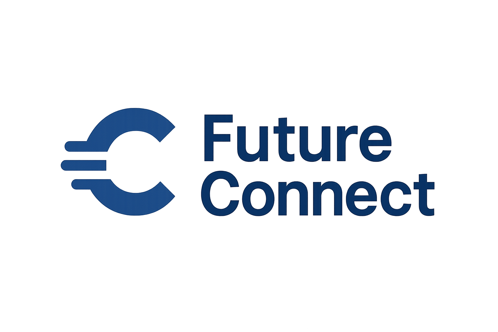
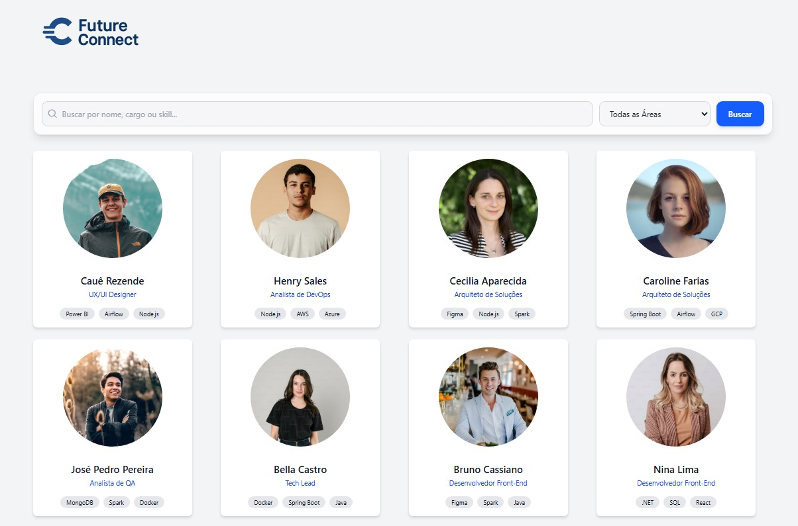

# 🚀🌐 FutureConnect - O Futuro do Networking

**Tagline:** *Conectando talentos, habilidades e oportunidades em uma plataforma ágil e humanizada.* 

<p align="center">


</p>

-----

## 📖 Sobre o Projeto

O **FutureConnect** é uma plataforma digital desenvolvida como parte da **Global Solution** da FIAP, focada no desafio "O Futuro do Trabalho".

**O Problema:** Em um mercado de trabalho cada vez mais dinâmico e remoto, encontrar o talento certo — ou a oportunidade certa — tornou-se um desafio de visibilidade. Currículos tradicionais não capturam a essência das *Soft Skills* (habilidades comportamentais) e a diversidade de talentos espalhados pelo país.

**A Solução:** O FutureConnect é um hub de conexões. Ele permite que recrutadores e profissionais visualizem perfis de forma rica e interativa, filtrando não apenas por cargo, mas por habilidades técnicas e comportamentais. A plataforma facilita o primeiro passo da conexão: a recomendação e o contato direto.

**Como funciona?**

1.  **Frontend (A Vitrine):** Uma interface moderna e responsiva onde o usuário pode navegar por um "Feed de Talentos", usando filtros inteligentes para encontrar exatamente quem procura (ex: "Desenvolvedor" em "São Paulo" com "Liderança").
2.  **Backend (O Cérebro):** Uma API robusta que gerencia os dados dos profissionais e processa o envio de mensagens e recomendações.
3.  **Interação:** Ao encontrar um perfil interessante, o usuário pode abrir detalhes completos e enviar uma mensagem direta ou uma recomendação profissional, que é salva instantaneamente no sistema.

-----

## ✨ Funcionalidades Principais

  - 🔍 **Busca Inteligente:** Filtre profissionais por nome, cargo, área de atuação (Dados, Design, Dev) ou competências específicas.
  - 📋 **Perfis Detalhados:** Visualize cards com foto, resumo, experiências, formação, idiomas e, o mais importante: *Hard Skills* e *Soft Skills*.
  - 💬 **Sistema de Mensagens:** Envie propostas de trabalho ou mensagens de networking diretamente pela plataforma.
  - ⭐ **Recomendações:** Ferramenta para recomendar profissionais, fomentando uma comunidade colaborativa.
  - 🌙 **Modo Escuro (Dark Mode):** Interface adaptável para conforto visual em qualquer horário de trabalho.
  - 📱 **Totalmente Responsivo:** Funciona perfeitamente em computadores, tablets e celulares.

-----

## 📸 Telas do Projeto

> *A interface foi pensada para ser limpa, intuitiva e focada no usuário.*

  - **Feed de Talentos & Filtros:**
    
    

-----



-----

## 🛠️ Tecnologias Utilizadas

| Categoria       | Tecnologia                                                                                                                                                                                                                                                                                                                                                                                                 | Descrição                                                      |
| :-------------- | :--------------------------------------------------------------------------------------------------------------------------------------------------------------------------------------------------------------------------------------------------------------------------------------------------------------------------------------------------------------------------------------------------------- | :------------------------------------------------------------- |
**Frontend** |    | Criação da interface visual rápida, interativa e bonita.       |
**Backend** |                                                                                                                                                                                                    | Servidor que gerencia as requisições e a lógica de negócio.    |
**Dados** |                                                                                                                                                                                                                                                                                                                             | Armazenamento leve e portátil de perfis e mensagens (NoSQL).   |
**Ferramentas** |                                                                                                                                                                                                                                    | Padronização de código e ícones modernos para a interface.     |

-----

## 🚀 Como Rodar o Projeto

Para ver o **FutureConnect** funcionando na sua máquina, você precisará ter o [Node.js](https://nodejs.org/) instalado. Siga os passos abaixo:

### 1\. Clone o Repositório

```bash
git clone https://github.com/gugasantos24/futureconnect.git
cd futureconnect
```

### 2\. Configurando o Backend (Servidor)

Abra um terminal e navegue até a pasta do backend:

```bash
cd backend
npm install  # Instala as dependências
npm start    # Inicia o servidor na porta 5000
```

*Você verá a mensagem: `🚀 Backend rodando em http://localhost:5000`*

### 3\. Configurando o Frontend (Interface)

Abra **outro** terminal (mantenha o anterior aberto) e navegue até a pasta do frontend:

```bash
cd frontend
npm install     # Instala as dependências (React, Tailwind, etc)
npm run dev     # Inicia o site
```

*O terminal mostrará um link (geralmente `http://localhost:5173`). Clique nele para acessar o FutureConnect\!*

-----

## 📂 Estrutura de Dados

O projeto utiliza arquivos JSON locais para simular um banco de dados, facilitando a portabilidade.

  - **`profiles.json`**: Contém a lista de talentos com fotos, cargos, skills e histórico.
  - **`messages.json`**: Armazena todas as mensagens e recomendações enviadas pela plataforma.

-----

## 👨‍💻 Desenvolvedores

Time responsável pela criação do FutureConnect para a Global Solution:

**RM:565191 Gabriel Akira Borges Kiyohara — FIAP (1ESPJ)**

**RM:561820 Gustavo Santos — FIAP (1ESPJ)**

**RM:556645 Mauro Carlos — FIAP (1ESPJ)**

-----

## 📄 Licença

Este projeto foi desenvolvido para fins acadêmicos. Sinta-se livre para usar como referência.

© 2025 FutureConnect Team